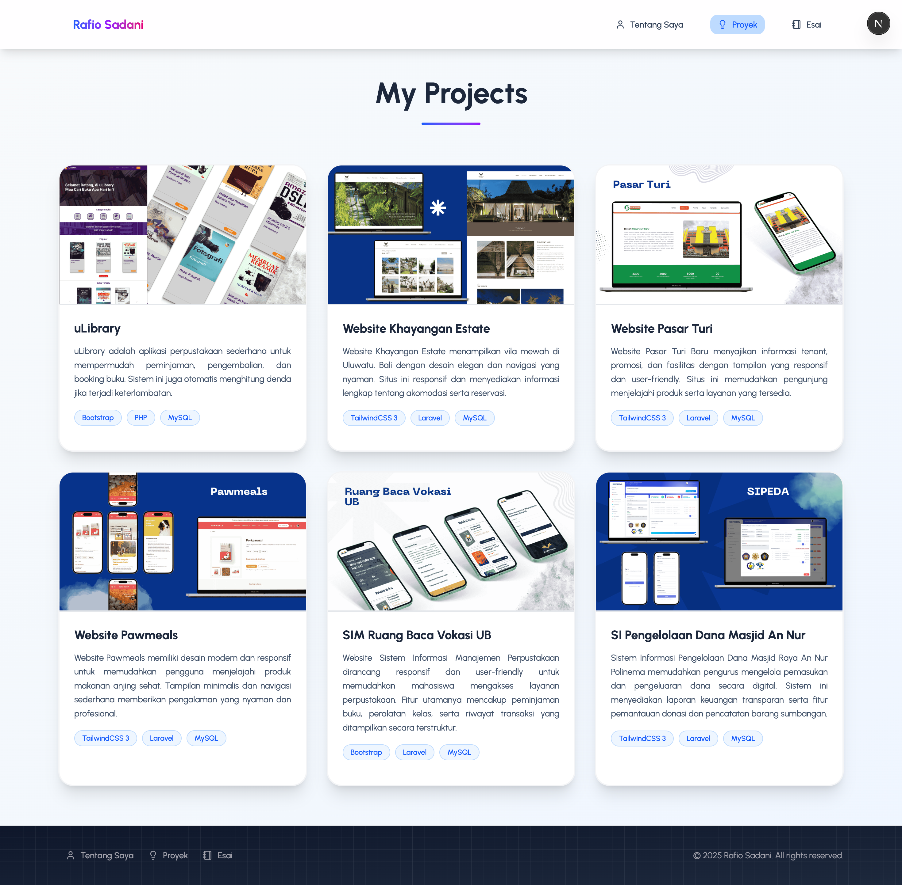
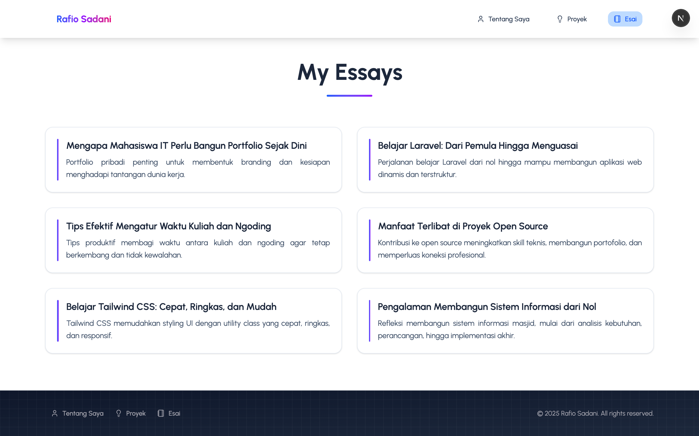

# Laporan Praktikum

|  | Pemrograman Berbasis Framework 2025 |
| ------ |-------------------------------------|
| NIM | 244107027004                        |
| Nama | Rafio Sadani                        |
| Kelas | TI - 4K                             |

## Langkah - Langkah Praktikum

1. Tampilan struktur folder project Website Portofolio 
   

2. Membuat halaman `Tentang Saya` untuk menampilkan biodata diri  
   ")

3. Membuat halaman `Proyek` untuk menampilkan beberapa proyek yg sudah dikerjakan  
   ")

4. Membuat halaman `Esai` yang memuat daftar esai yang telah ditulis
   ")

## Tugas Praktikum

1. Memodifikasi halaman `Tentang Saya` menjadi tampilan yang lebih menarik
   

2. Memodifikasi halaman `Proyek` menjadi lebih detail dan rapih
   

3. Memodifikasi halaman `Esai` dengan grid daftar artikel yg telah ditulis
   